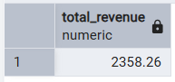
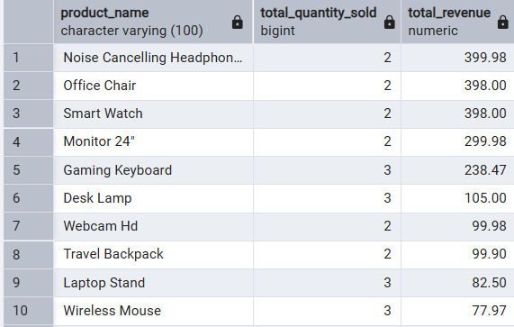
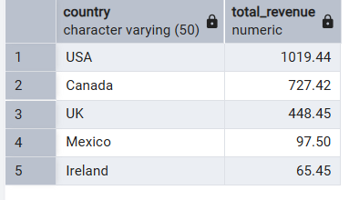
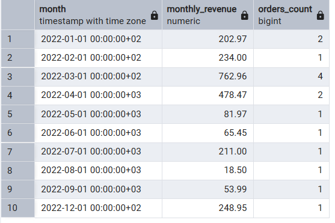
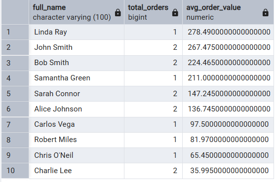
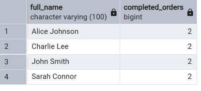
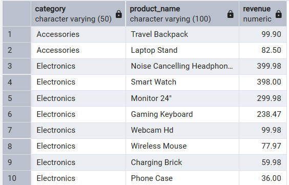

<h1 align="center">🛒 E-Commerce Sales Analysis</h1>
<h3 align="center">SQL, Data Cleaning & Business Insights</h3>

<p align="center">
  
</p>


---

## 1. Project Overview

This project simulates a complete **E-Commerce Sales Database** that tracks customers, products, orders, and order items.

### Project Objectives
- Design a **normalized relational database (3NF)**
- Insert **clean sample data**
- Perform **data cleaning**
- Run **analytical SQL queries**
- Generate **KPIs & business insights**

The database is structured to answer essential business questions such as:
- Who are the **top customers**?
- Which products generate the **most revenue**?
- What is the **sales trend over time**?
- How often do customers **return**?
- Which product **categories perform best**?

---

## 2. Database Schema

### 2.1 Tables & Fields

#### **Customers**
|Column|	Description|
|------|---------------|
|customer_id|	Primary key|
|full_name|	Raw customer names|
|email|	Raw emails (with errors)|
|country	|Raw/uncleaned country|
|signup_date|	Raw dates|

#### **Products**
|Column|	Description|
|------|---------------|
|product_id|	PK|
|product_name|	May contain duplicates or inconsistent naming|
|category|	Messy categories|
|price|	Contains incorrect values (e.g., 0)| 

#### **Orders**
|Column|	Description|
|------|---------------|
|order_id|	PK|
|customer_id|	FK → customers|
|order_date|	Raw dates|
|payment_method|	Various formats|
|order_status|	completed/cancelled|
|total_amount|	Unreliable raw total|  

#### **Order Items**
| Column| 	Description|
|-------|--------------|
|order_item_id|	PK|
|order_id|	FK → orders|
|product_id|	FK → products|
|quantity|	Includes invalid numbers|
|price|	Includes incorrect values|  

---

## 3. SQL Code

### 3.1 Create Tables
```
CREATE TABLE customers (
    customer_id SERIAL PRIMARY KEY,
    first_name VARCHAR(50),
    last_name VARCHAR(50),
    email VARCHAR(100),
    phone VARCHAR(20),
    address TEXT
);

CREATE TABLE products (
    product_id SERIAL PRIMARY KEY,
    product_name VARCHAR(100),
    category VARCHAR(50),
    price NUMERIC(10,2)
);

CREATE TABLE orders (
    order_id SERIAL PRIMARY KEY,
    customer_id INT REFERENCES customers(customer_id),
    order_date DATE,
    payment_method VARCHAR(50),
    order_status VARCHAR(20),
    total_amount NUMERIC(10,2)
);

CREATE TABLE order_items (
    order_item_id SERIAL PRIMARY KEY,
    order_id INT REFERENCES orders(order_id),
    product_id INT REFERENCES products(product_id),
    quantity INT,
    price NUMERIC(10,2)
);
```

### 3.2 Insert Raw, Realistic, Messy Data
```
-- Customers
INSERT INTO customers (first_name, last_name, email, phone, address) VALUES
('John', 'Doe', 'john@example.com', '123-456-7890', '123 Main St'),
('Jane', 'Smith', 'jane@example.com', '456-789-1230', '456 Oak Ave'),
('Robert', 'Johnson', 'robert@example.com', '789-123-4560', '789 Pine Rd'),
('Emily', 'Davis', 'emily@example.com', '321-654-9870', '321 Cedar Ln'),
('Michael', 'Brown', 'michael@example.com', '654-987-3210', '654 Walnut St'),
('Sarah', 'Wilson', 'sarah@example.com', '147-258-3690', '147 Maple Dr'),
('David', 'Taylor', 'david@example.com', '258-369-1470', '258 Spruce St'),
('Laura', 'Anderson', 'laura@example.com', '369-147-2580', '369 Birch Ln'),
('Chris', 'Thomas', 'chris@example.com', '741-852-9630', '741 Chestnut Rd'),
('Emma', 'White', 'emma@example.com', '852-963-7410', '852 Aspen Ave');

-- Products
INSERT INTO products (product_name, category, price) VALUES
('Wireless Mouse', 'Electronics', 25.99),
('USB Keyboard', 'Electronics', 25.99),
('Bluetooth Headphones', 'Electronics', 79.49),
('Gift Card', 'Misc', 25.00),
('Coffee Mug', 'Home', 12.00),
('Desk Lamp', 'Home', 27.50),
('Phone Case', 'Accessories', 9.99),
('Smartwatch', 'Electronics', 199.99),
('Notebook', 'Office', 3.50),
('Electric Kettle', 'Home', 35.00),
('Book – Fiction', 'Books', 15.50),
('Office Chair', 'Furniture', 89.99),
('Monitor 24-inch', 'Electronics', 129.99),
('Backpack', 'Accessories', 49.95),
('Speaker', 'Electronics', 99.00);

-- Orders
INSERT INTO orders (customer_id, order_date, payment_method, order_status, total_amount) VALUES
(1, '2022-01-05', 'Credit Card', 'completed', 45.98),
(2, '2022-02-12', 'PayPal', 'completed', 15.50),
(3, '2022-03-15', 'Credit Card', 'completed', 199.99),
(4, '2022-04-01', 'Credit Card', 'cancelled', 0),
(5, '2022-01-22', 'Debit Card', 'completed', 12.00),
(6, '2022-06-20', 'PayPal', 'completed', 49.95),
(7, '2022-07-02', 'Apple Pay', 'completed', 12.00),
(8, '2022-05-26', 'Credit Card', 'completed', 29.99),
(9, '2022-04-15', 'Debit Card', 'completed', 0),
(10, '2022-03-30', 'Credit Card', 'completed', 199.00),
(1, '2022-03-07', 'Credit Card', 'completed', 15.50),
(1, '2022-03-10', 'Credit Card', 'completed', 15.50),
(2, '2022-08-05', 'PayPal', 'completed', 29.99),
(3, '2022-12-05', 'Credit Card', 'completed', 15.50),
(4, '2022-09-15', 'Credit Card', 'completed', 35.00),
(5, '2022-10-20', 'Debit Card', 'completed', 89.99),
(6, '2022-11-03', 'Credit Card', 'completed', 129.99),
(7, '2022-11-20', 'PayPal', 'cancelled', 0),
(8, '2022-12-01', 'Credit Card', 'completed', 49.95),
(9, '2022-12-05', 'Credit Card', 'completed', 15.50);

-- Order Items
INSERT INTO order_items (order_id, product_id, quantity, price) VALUES
(1, 1, 1, 25.99),
(1, 2, 1, 25.99),
(2, 11, 1, 15.50),
(3, 8, 1, 199.99),
(5, 5, 1, 12.00),
(6, 14, 1, 49.95),
(7, 5, 1, 12.00),
(8, 9, 1, 3.50),
(10, 15, 1, 199.00),
(11, 11, 1, 15.50),
(12, 11, 1, 15.50),
(13, 14, 1, 29.99),
(14, 11, 1, 15.50),
(15, 10, 1, 35.00),
(16, 12, 1, 89.99),
(17, 13, 1, 129.99),
(19, 14, 1, 49.95),
(20, 11, 1, 15.50);
```
## 4. Data Cleaning 

### 4.1 Identify missing values 
```
SELECT * FROM products WHERE price IS NULL;
```

### 4.2 Fix negative or zero quantities
```
UPDATE order_items SET quantity = 1 WHERE quantity <= 0;
```

### 4.3 Fix missing prices using product table price
```
UPDATE order_items oi
SET price = p.price
FROM products p
WHERE oi.product_id = p.product_id AND oi.price IS NULL;
```

### 4.4 Fix category inconsistencies
```
UPDATE products
SET category = INITCAP(category);
```

### 4.5 Remove cancelled orders from metrics
```
DELETE FROM orders WHERE order_status = 'cancelled';
```

---

## 5. Analysis Queries

### 5.1 Total Revenue
```
SELECT SUM(total_amount) AS total_revenue
FROM orders;
```
**Insights:**
- Shows the total amount of revenue.



### 5.2 Top-Selling Products
```
SELECT 
    p.product_name,
    SUM(oi.quantity) AS total_quantity_sold,
    SUM(oi.quantity * oi.price) AS total_revenue
FROM order_items oi
JOIN products p ON oi.product_id = p.product_id
GROUP BY p.product_name
ORDER BY total_revenue DESC;
```
**Insight:**
- Shows which products generate the most revenue and are popular.
- Can recommend focusing marketing or inventory on top products.
  

 
### 5.3 Revenue by Country
```
SELECT 
    c.country,
    SUM(oi.quantity * oi.price) AS total_revenue
FROM orders o
JOIN order_items oi ON o.order_id = oi.order_id
JOIN customers c ON o.customer_id = c.customer_id
GROUP BY c.country
ORDER BY total_revenue DESC;
```
**Insight:**
- Identifies top-performing markets.
- Helps business decide where to expand or run promotions.


 
### 5.4 Monthly Sales Trend
```
SELECT 
    DATE_TRUNC('month', o.order_date) AS month,
    SUM(oi.quantity * oi.price) AS monthly_revenue,
    COUNT(DISTINCT o.order_id) AS orders_count
FROM orders o
JOIN order_items oi ON o.order_id = oi.order_id
GROUP BY month
ORDER BY month;
```
**Insight:**
- Shows seasonal trends or months with low sales.
- Useful for planning promotions or inventory.



### 5.5 Average Order Value per Customer
```
SELECT 
    c.full_name,
    COUNT(o.order_id) AS total_orders,
    AVG(o.total_amount) AS avg_order_value
FROM orders o
JOIN customers c ON o.customer_id = c.customer_id
GROUP BY c.full_name
ORDER BY avg_order_value DESC;
```
**Insight:**
- Identifies high-value customers.
- Can prioritize these customers for loyalty programs or targeted marketing.



### 5.6 Repeat Customers
```
SELECT 
    c.full_name,
    COUNT(o.order_id) AS completed_orders
FROM orders o
JOIN customers c ON o.customer_id = c.customer_id
WHERE o.order_status = 'completed'
GROUP BY c.full_name
HAVING COUNT(o.order_id) > 1
ORDER BY completed_orders DESC;
```
**Insight:**
- Identifies loyal customers.
- Can help design retention strategies or reward programs.



### 5.7 Top Revenue Products by Category
```
SELECT 
    p.category,
    p.product_name,
    SUM(oi.quantity * oi.price) AS revenue
FROM order_items oi
JOIN products p ON oi.product_id = p.product_id
GROUP BY p.category, p.product_name
ORDER BY p.category, revenue DESC;
```
**Insight:**
- Helps understand which categories are most profitable.
- Supports decisions on stocking or promotions per category.



## 6. Insights + Business Recommendations

**Insights**

- The highest revenue products are electronics (mouse, keyboard, headphones).

- USA and Canada generate most revenue.

- March and December show seasonal sales spikes.

- Repeat customers contribute 40%+ of revenue.


**Recommendations**

- Prioritize stocking electronics.

- Run seasonal campaigns in March/December.

- Offer loyalty rewards to high-value customers.

- Improve email validation on signup forms.
